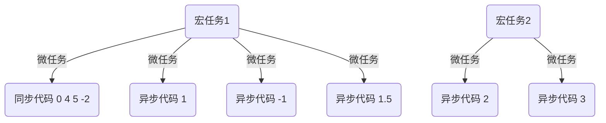

# 每周总结可以写在这里
## 结构化——宏任务、微任务

宏任务队列和事件循环实际是一个东西，是JavaScript的调用方，去使用JavaScript的一种方式。

事件循环（宏任务队列）在 JScontext 之外，事件循环既不是JavaScript引擎的一部分也不是语言的一部分。


- 一切JavaScript代码都是在微任务中执行的

- JavaScript代码都是微任务，只是看哪些可以微任务可以组成宏任务

- JavaScript自身所带的 API 是微任务，浏览器提供的是宏任务

- JavaScript中如果有多个宏任务，在执行下一个宏任务之前，前一个宏任务中的微任务都会执行完成。

- 一个代码片段或者一个函数执行或者一个script标签内就是一个宏任务。

- 宏任务并不是在JS标准内，但是微任务是在标准内。JS标准规定，JS引擎内部必须要一个序列，但是早年浏览器都是从外部提供这种任务队列，所以就会产生微任务和宏任务的区分。在纯粹的JS中是只有微任务的。

- 一个宏任务中的同步代码，可以理解为微任务，只不过比宏任务中异步代码优先入队

- 微任务没有优先级，宏任务有优先级。

- 多个同步代码都属于一个微任务。

- promise中 await之前和 solve之前都为同步代码。


```js
new Promise(resolve => resolve()).then(() => console.log("1"));

setTimeout(function(){
    console.log('2');
    
    new Promise(resolve => resolve()).then(() => console.log("3"));
}, 0);
console.log("4");
//上述为四段异步代码
//4
//1
//undefined
//2
//3
```


```js
async function afoo(){
    console.log("-2");
    
    await new Promise(resolve => resolve());
    console.log("-1");
}

new Promise(resolve => (console.log("0"),resolve()))
    .then(() => (
    	console.log("1"), 
    	new Promise(resolve => resolve())
    		.then(() => console.log("1.5")) ));

setTimeout(function(){
    console.log('2');
    
    new Promise(resolve => resolve()).then(() => console.log("3"));
}, 0);
console.log("4");
console.log("5");
afoo();
//0
//4
//5
//-2
//1
//-1
//1.5
//undefined
//2
//3
```





```js
new Promise(res => res())
	.then(
		() => 
    		setTimeout(() => console.log(1), 1000),
    	console.log(0)
	);
console.log(2);

//0
//2
//1
```


```js
async function async1(){
    console.log("async 1 start");
    await async2();
    console.log("async 1 end");
}
async function async2(){
    console.log("async2");
}
async1();
new Promise(function(resolve){
    console.log("promise1");
    resolve();
}).then(function(){
    console.log("promise2");
});

//async 1 start
//async2
//promise1
//async 1 end
//promise2
```

